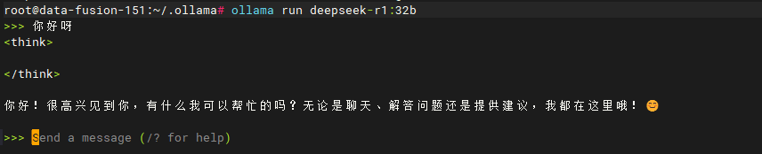
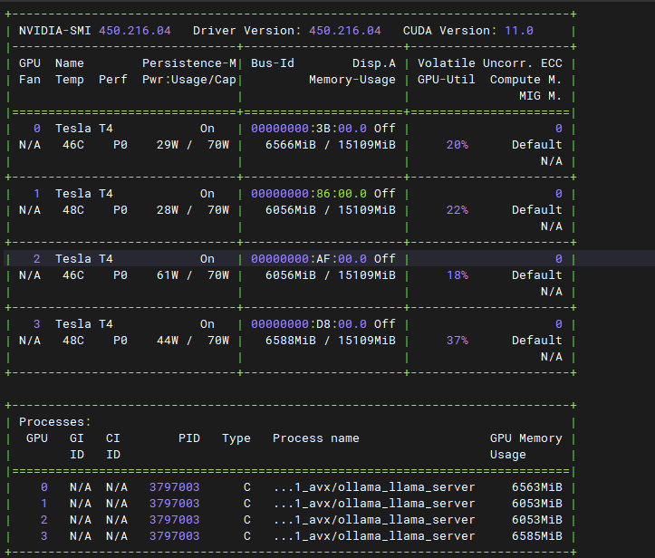
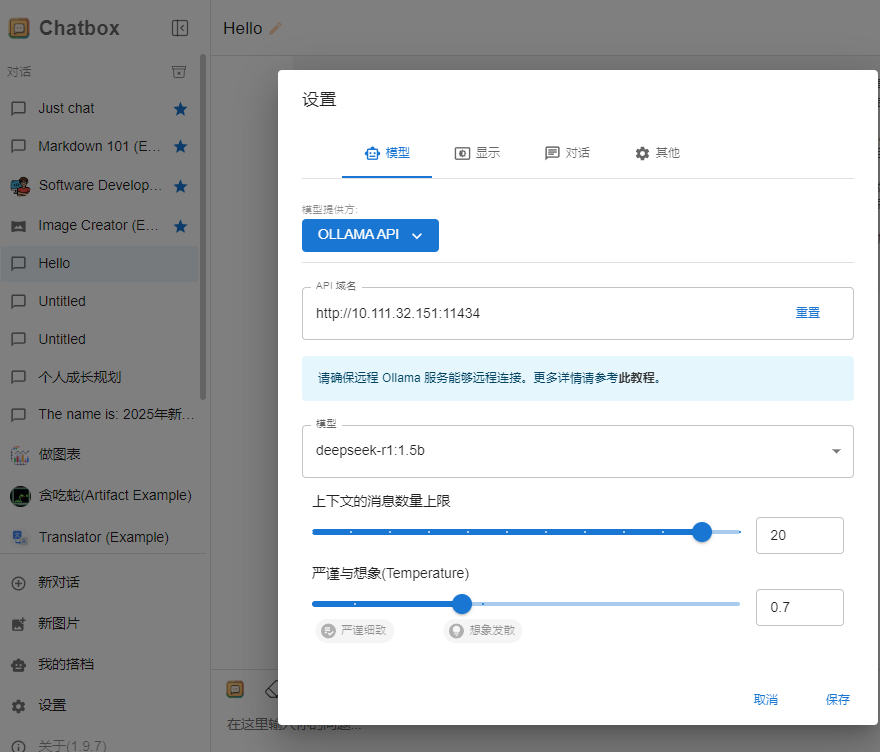
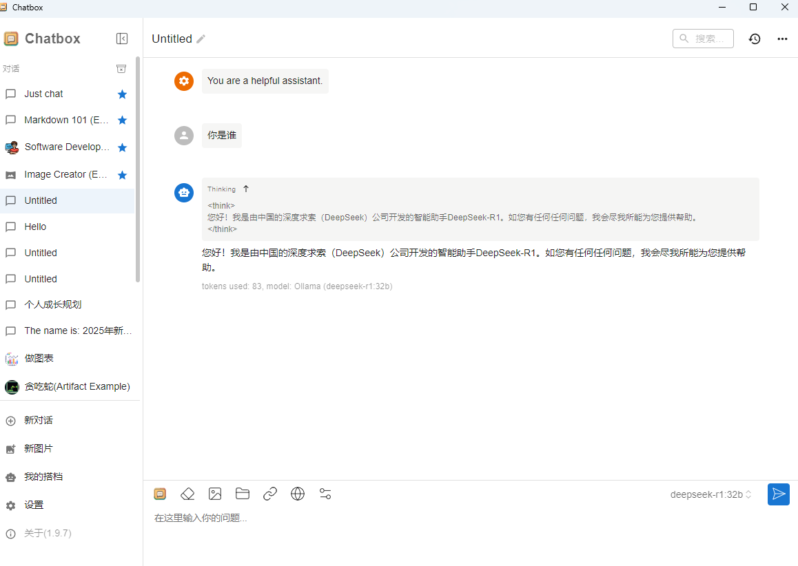

# 本地部署deepseek

### 使用docker运行ollama实列
使用docker启动ollama实列，使用gpu模式
```
docker run -d -v /root/ollama:/root/.ollama -p 11434:11434 --security-opt seccomp=unconfined --network host --gpus=all --name ollama ollama/ollama
```

通过ollama官网查看deepseek的模型，有不同的参数大小的模型，对应精度不同。精度越高模型越大对应使用的资源越多，本次使用32b的模型作为例子使用。

运行模型，并且提问得到答案。
```shell
ollama run deepseek-r1:32b
```



查看显卡的占用情况，可以看到模型占了4张卡，每张卡使用了6GB的显存。



### 安装chatbox可视化工具
下载：https://chatboxai.app/zh 
可以使用chatbox可视化对话框来替代命令行的回复，让回答看的更加直观和清晰。

新建一个对话配置模型提供方为ollama pai，并且配置模型并保存


在chatbox中提问
