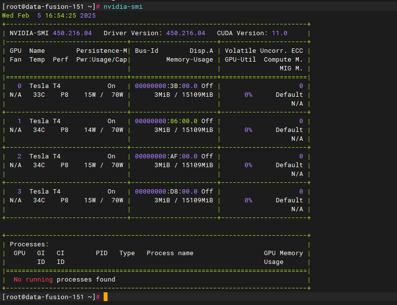
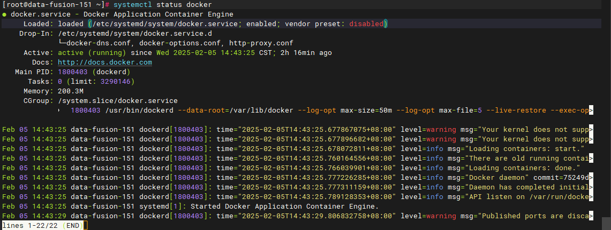
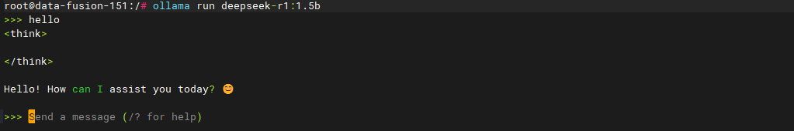

# 安装ollama
Ollama是一个专为在本地机器上便捷部署和运行大型语言模型（LLM）而设计的开源服务工具。可以让用户轻松地加载、运行和交互各种大语言模型。
地址：https://ollama.com/

## linux上使用docker安装运行ollama

### 安装docker和nvidia驱动
先安装docker和nvidia-container-toolkit

`nvidia-smi` 命令查看显卡

```shell
nvidia-smi
```




`systemctl status docker` 查看docker状态



### docker运行ollama
启动ollama实例
```shell
docker run -d -v /root/ollama:/root/.ollama -p 11434:11434 --security-opt seccomp=unconfined --network host --gpus=all --name ollama ollama/ollama
```

进入容器中
```shell
docker exec -it 20e9c bash
```

运行模型
```
ollama run deepseek-r1:1.5b
```



更多模型链接可以查看ollama官网，点击 [ollama model链接](https://ollama.com/search)


模型下载到本地的路径 `./root/.ollama/models`

`/root/ollama/models/blobs/`下存储了模型的blobs数据，如果本机下载慢可以用其他机器下载好之后放到此目录下，则可以加载到这个模型。